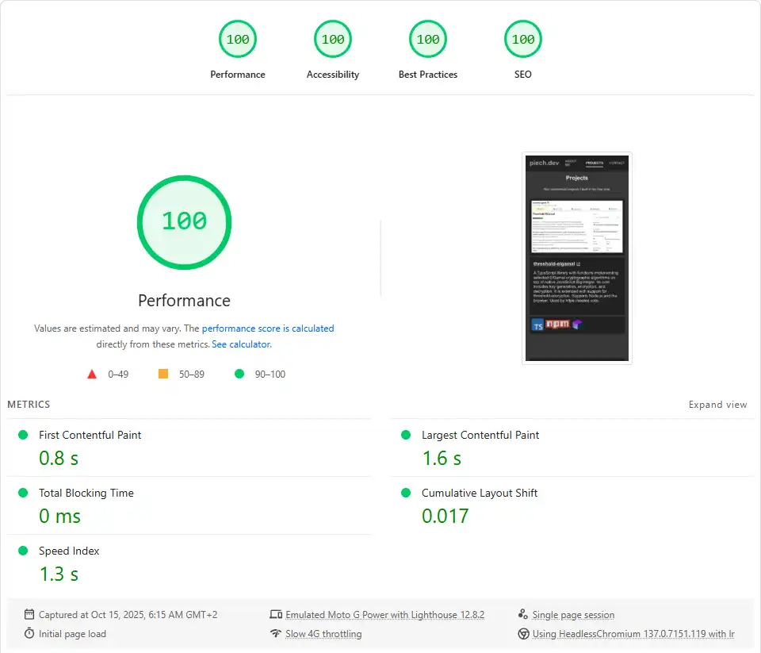

# piech.dev

[piech.dev](https://piech.dev)

My personal page. Over time it turned into a complex project itself: it supports loading all projects' information directly from GitHub, renders GitHub's markdown, the whole page is pre-rendered and served with zero JS. It also includes dynamic <meta> tags for each project page, including individual og:image tags with sizes.

## Dynamic, GitHub-based project list and details

- Projects pull metadata and READMEs directly from GitHub at build time
- Markdown rendering transforms relative links to proper URLs and handles videos, so that you can see video previews of my projects without leaving my site.
- GitHub topics automatically become \<meta> keywords.
- GitHub information, as well as images are dynamically pulled to each project's \<head> into appropriate og: tags, allowing for custom preview card of each project in social media and on messengers.

## React pre-rendering with zero JavaScript served to the user

- The whole site, including all project routes, is pre-rendered with React Router in framework mode into HTML.
- The site ships without ANY client-side JavaScript despite being built in React.
- For performance reasons, the whole CSS is inlined into HTML, as there is so little of it and it significantly sped up page load times and it eliminates the awful Flash of Unstyled Content no matter the connection speed.
- Images are utilizing Netlify Image CDN to speed up their load times and to avoid serving oversized images.
- Thanks to the above and a ton of other optimizations, all routes, including the heaviest /projects route score perfect 100/100/100/100 [Google Lighthouse](https://pagespeed.web.dev/) mobile which throttles to slow 4G.

