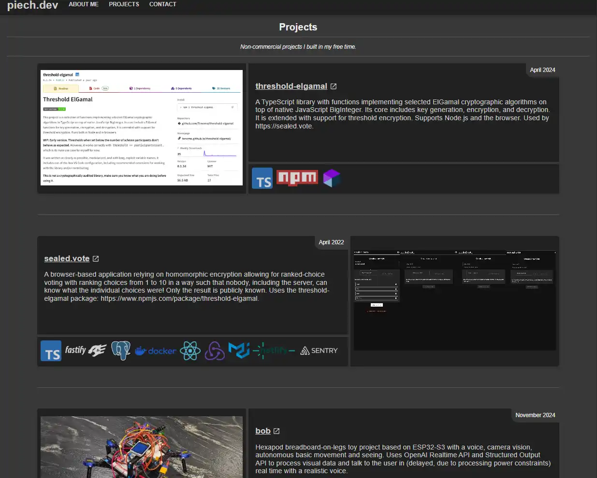

# piech.dev

[piech.dev](https://piech.dev)

My personal page. Over time it turned into a complex project itself:

- Despite being written in React, the whole page is pre-rendered and served with zero JavaScript!
- It supports loading all projects' information directly from GitHub.
- GitHub's markdown from the projects' readmes is rendered within the page, including media.
- Includes dynamic \<meta> tags for each project page, including individual og:image tags with sizes.
- All routes have appropriate JSON-LD objects with all relevant information, even if Google or other search engines currently don't support some of them.
- Thanks to the above and a bunch of other optimizations, all routes, including the heaviest /projects route, score a perfect 100/100/100/100 on [Google Lighthouse](https://pagespeed.web.dev/) mobile, which throttles to a slow 4G network connection.

_Not a single word of this readme was written with AI. Letting you know just in case you don't enjoy reading AI-generated documentation._

## GitHub-based personal projects browser

- The projects/ page is managed via minimal configuration, just based on repository names which are then fetched during the pre-build step. Projects metadata and READMEs are fetched directly from GitHub at build time.
- Markdown rendering transforms relative links to proper URLs and handles videos, so that you can see video previews of my projects without leaving my site.
- GitHub repository topics automatically become \<meta> keywords.
- GitHub information, as well as images are dynamically pulled to each project's \<head> into appropriate og: tags, allowing for custom preview card of each project in social media and on messengers.

## Pre-rendering React with zero JavaScript served to the user

- The whole site, including all project routes, is pre-rendered with React Router in framework mode into HTML.
- The site ships without ANY client-side JavaScript despite being built in React. The build tools have been fighting me on this, so I'm traversing the build directory and deleting all JavaScript even if it wouldn't be linked to, "just to be safe" :)
- For performance reasons, all CSS is inlined into HTML, as there is so little of it (in the grand scheme of things and network payloads). It significantly sped up page load times and it eliminates the awful Flash of Unstyled Content no matter the user's connection speed.
- Images are utilizing Netlify Image CDN to speed up their load times and to avoid serving oversized images.

## Post-build scripts

As of 2025, if you want to use React for generating static HTML sites and you don't rely on all-batteries-included frameworks/services, the ecosystem support is quite poor. React-router v7 with its framework mode and pre-rendering support changed the situation for the better. Still, it is assumed you will serve the .html static assets and then hydrate the page with JavaScript. If you want to have a true zero-JS output, you have do some of the wiring yourself. Moreover, most popular NPM packages for inlining CSS inline it into each html element's tags, which doesn't support media queries.

This resulted in the project using the following post-build steps:

1. Transforming image paths to use Netlify Image CDN, scans all .html files and looks for images matching the criteria (it doesn't touch the og:image assets, for instance).
2. Inlining all CSS. Finds all .html files, resolves the files and dumps all their content into a single \<style> tag within \<head>.
3. Removing `dist/server`, couldn't make Vite + React Router not output it. We are only serving the client "app", which consists of static .html files after build.
4. Removing `dist/client/assets`, we don't need CSS/JS assets after CSS has been inlined.
5. Traversing `dist/client` to remove all .js files from it. Again, could not make Vite + React Router not output some .js files, even if they were unused and wouldn't be served to the users anyway. Why waste network traffic and time on deploying those?
6. Generating a sitemap with an in-house script using the `sitemap` package. `vite-plugin-sitemap` doesn't work with URLs with dots, apparently, which some of my projects have in their paths, e.g. it truncates /aliases.sh to /aliases.

### Why use React at all?

One might ask, if you don't want to bundle any JavaScript, why bother using React at all, just write HTML & CSS or use tools meant for the purpose.

First of all, I want a framework to provide me with a reusable component system and state management logic during the pre-render step and I find React easy to use for this purpose.

There are most likely better libraries/frameworks to do what I'm doing, but the second simple reason why I went with React is that I'm just comfortable with it and I wanted to save time. Did I end up saving time writing all this post-rendering logic and fighting the build tools not to require JS? Probably not, but I embrace the sunk-cost fallacy for my personal site and plan to continue with React :)

Another reason is that I initially intended for the whole page to be hydrated - and I might still start doing that if I need more interactivity - but I realized all that I'm doing can be served without any JavaScript. It's unlikely I'll do it, but it's good to always have that option: with minimal changes to the project, this static-content webpage can be transformed into a client-side React app.

## Development

Notes for myself (Piotr) to follow when making changes to the project. At the time of writing it seems a bit redundant, but there's a nonzero chance that future Piotr will be very grateful.

### Adding a new route

Steps to follow when adding a new route to the app:

1. Write the new route as a feature or sub-feature in `src/features/`.
2. Create a new route file in `src/routes/` that uses the new component(s) and add at least the og:image tag image asset to `public/media/projects/og_images/`.
3. Add the route to `src/routes.ts`.
4. Add the route path to the prerender() array in react-router.config.ts
5. Add `<link as="document" href="/.../" rel="prefetch" />` for the new route in `src/root.tsx`.
6. Update Header with the new route navigation, if needed.
7. `netlify.toml`:
    - If the route replaces any previous route, add a legacy redirect.
    - If there are new media assets for the new route, add appropriate headers.
8. Add files to sitemap extensions in `src/utils/generateSitemap.ts` if needed.

### Adding a new project

Steps to follow when adding a new project to `/projects/`:

1. Make sure the GitHub repo is publicly accessible, has topics ("keywords"/"tags"), repo description (the short, character-limited one), and a descriptive README.md, preferably with some media assets to make it more interesting.
2. Add a video (preferable) or an image to `public/media/projects/` that will be project's preview on the project card.
3. Add an image to be used for og:image and in JSON-LD to `public/media/projects/og_images/`.
4. If there are any new technologies used, add them to `src/features/Projects/technologies.ts`. Add their logos to `public/media/logos/`.
5. Add the new project to `src/features/Projects/projectsList.ts`.

The project should at that point appear in the `/projects/` route.

At the moment only GitHub-based projects are supported.
